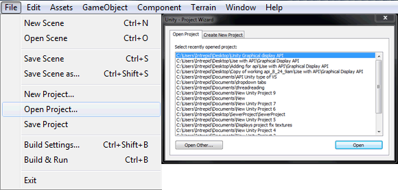
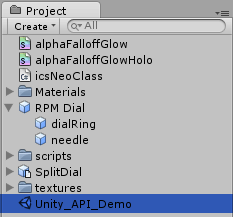
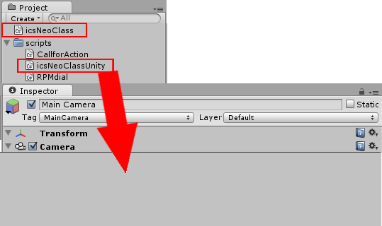
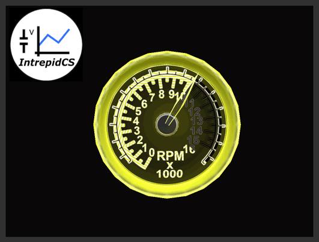

# Unity3D Graphic Display API

### Do the following steps to use Unity3D Graphic Display:

First set the scene for running an .exe file, then an explanation of how the scripts work.

### Example

This is the Unity3D Demo in its entirety included to show how the API all works together; The example files are included in the following file: [`Unity3d Graphics Panel Demo (1537kB)`](https://cdn.intrepidcs.net/guides/neoVIDLL/\_downloads/3ee14bf57d0ce464be05590d88c3aae3/unityGraphicalDisplayAPI.zip)

Open Unity3D. Locate and open the project folder called **“Unity Graphic display API”.** (Figure 1)

In the project panel open the Unity scene called **Unity\_API\_Demo**. Once opened, in the game view is a place holder for the graphical display. This is where all the data will be visually displayed upon execution of the application. (Figure 2)

Next, locate the **icsNeoClass.cs** and make sure it is in the correct folder, this imports the **.DLL** into the project panel (cannot be in any other folder, other then the main **“project asset folder”).**

Locate **IcsNeoClassUnity.cs**, located in the Scripts folder. This example script handles the functions of the Intrepid Hardware; open, close, transmit, receive, ect… Then attach the **IcsNeoClassUnity.cs** on the Main Camera. (refer to figure 3)

The demo should be all set up and ready to play out at this point. Press the play button near the top of the Unity3D windows to enter play mode and begin the demo. (Figure 4)

