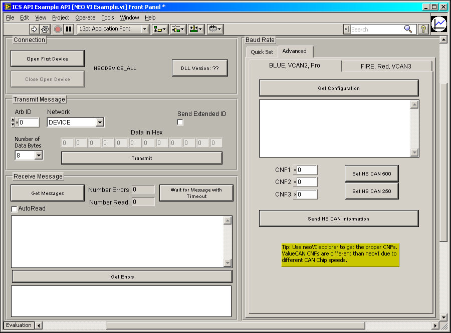

# Using the API in LabVIEW - intrepidcs API

### Overview

The intrepidcs API packages all of the WIN32 methods into LabVIEW LLB. Inside the LLB the sub VIs can be accessed to make it easy for you to use neoVI with National Instruments LabVIEW.

### Steps to use neoVI in LabVIEW

Open the “NEO VI Example.llb” found in the [`Nlabv_neo.zip (546kB)`](https://cdn.intrepidcs.net/guides/neoVIDLL/\_downloads/6784fbd1fe42ce22e0eb0da0b9ed0e6b/Nlabv\_neo.zip) file. When you first access the main VI or sub VI’s you may receive a warning regarding a Dependency missing. Make sure that your project is pointing to the icsneo40.dll. This is normally installed to the system32 or SysWOW64 directories.

### Example

A LabVIEW example (Figure 1) is included to show how the API all works together. An example project can be found here: [`Nlabv_neo.zip (546kB)`](https://cdn.intrepidcs.net/guides/neoVIDLL/\_downloads/6784fbd1fe42ce22e0eb0da0b9ed0e6b/Nlabv\_neo.zip).

The example shows how to open and close communication to the driver, send messages and read messages on the networks.

