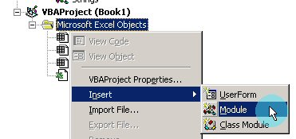
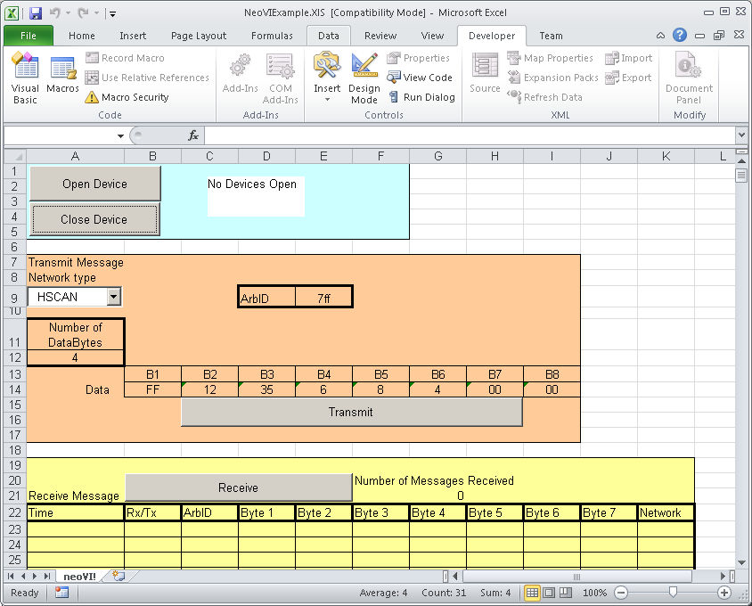

# Using the intrepidcs API in Excel - intrepidcs API

To use the intrepidcs API in Excel or other VBA supported application add the [`bas_neoVI.vb`](https://cdn.intrepidcs.net/guides/neoVIDLL/\_downloads/eff7ce57dd442e09675a9d786b865bb4/bas\_neoVI.zip) module into your project (figure 1) by right clicking on the Project in the VBA Editor and selecting Insert and then Module. Open the bas\_neoVI.vb. Then, call the methods as defined in the [Basic Operation](./) document. The function calls for use in VBA are the same as the calls in Visual Basic 6.

### Example

A VBA Excel example (Figure 1) is included to show how the API all works together. This project only has 1 file, NeoVIExample.XlS. Make sure macros are enabled to run this example. All the needed project files are included in the following file: [`ExcelVBA.zip`](https://cdn.intrepidcs.net/guides/neoVIDLL/\_downloads/a815dd1e75dd46669e998dd430a764ce/ExcelVBA.zip)

The example shows how to open and close communication to the driver, send messages and read messages on the networks.

