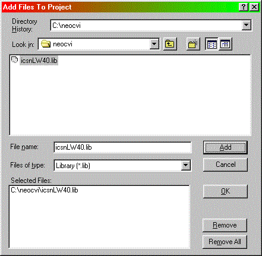
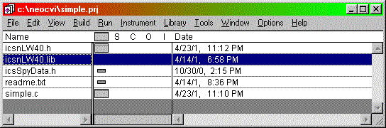
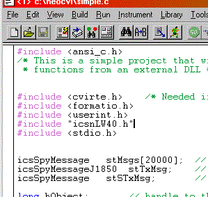
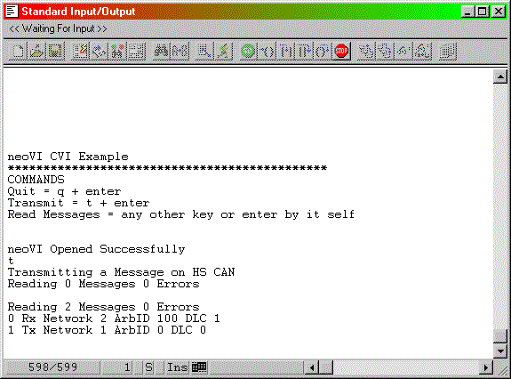

# Using the intrepidcs API in LabWindows CVI - intrepidcs API

### Do the following steps to use neoVI in LabWindows CVI:

1. Copy the import library [`icsnLW40.lib`](https://cdn.intrepidcs.net/guides/neoVIDLL/\_downloads/d1f3dcbcba178345f051f879ec480914/icsnLW40.lib) , header file [`icsnLW40.h`](https://cdn.intrepidcs.net/guides/neoVIDLL/\_downloads/598f143f1f75ef5ae5fd00ca8a90b941/icsnLW40.h) , and data structure file [`icsspyData.h`](https://cdn.intrepidcs.net/guides/neoVIDLL/\_downloads/992e8da1b2d36ae30971680acb37b1e1/icsspyData.h) to your project directory.
2. Link to icsnLW40.lib import library by selecting Add Files To Project from the Edit pull down menu. In the “Add Files To Project” dialog select the icsnLW40.lib file (figure 1). You can also the headers from step 1 if you wish. Your project should now list the files you added (figure 2).

3\. Include the header icsnLW40.h in your C module (Figure 3).

4\. Finally, call the methods as defined in the [Basic Operation](./) document.

### Example

A National Instruments LabWindows example (Figure 1) is included to show how the API all works together. The example files are included in the following file: [`LWneoVI.zip (10kB)`](https://cdn.intrepidcs.net/guides/neoVIDLL/\_downloads/66b9855e6b7dfff4916460ef94d96e89/LWneoVI.zip)

The example shows how to open and close communication to the driver, send messages and read messages on the networks.

