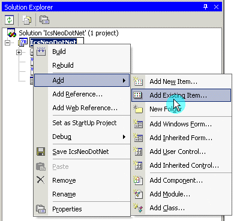
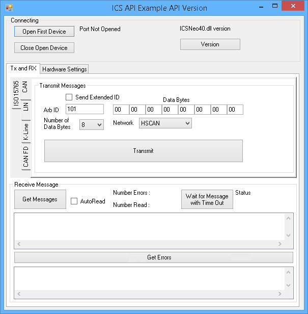

# Using the intrepidcs API in Visual Basic - intrepidcs API

To use the intrepidcs API in Visual Basic add the Download the file [`bas_neoVI.vb`](https://cdn.intrepidcs.net/guides/neoVIDLL/\_downloads/eff7ce57dd442e09675a9d786b865bb4/bas\_neoVI.zip) module into the VB project (figure 1) by right clicking on the Solution and selecting Add Existing Item from the Add menu. Open the bas\_neoVI.vb. Then, call the methods as defined in the [WIN32 API Functions and Types](../win32-api-overview-intrepidcs-api/) Section of this document.

### Example

A Visual Basic Dot Net 2010 example (Figure 1) is included to show how the API all works together. The main project files are as follows: 1) the project file: IcsNeoDotNet.sln 2) the form file : Form1.vb, and 3) the neoVI module : bas\_neoVI.vb. All project files are included in the following file [`VBnet2010.zip`](https://cdn.intrepidcs.net/guides/neoVIDLL/\_downloads/1fd51321822c15711eaf4ee6b2a0024e/VBnet2010.zip). This project will open in Visual Studio 2010, 2012, 2013, 2015, and 2017.

The example shows how to open and close communication to the driver, send messages and read messages on the networks.

